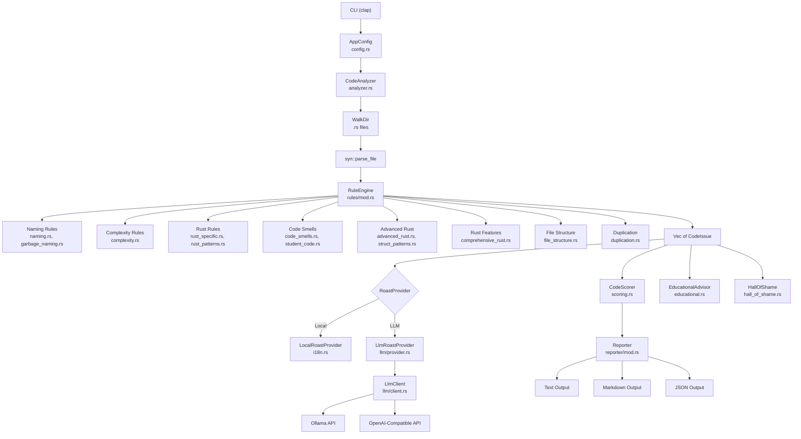

# 🗑️ Garbage Code Hunter

[English](README.md) | [中文](README_zh.md)

[](https://www.rust-lang.org)
[](LICENSE)
[](https://crates.io/crates/garbage-code-hunter)
[]()

A humorous Rust code quality detector that roasts your garbage code with style! 🔥

*The most sarcastic Rust static analysis assistant you'll ever meet* 🎭   Make coding more interesting, and have fun 😏.

```
Inspiration from https://github.com/Done-0/fuck-u-code.git
```

Unlike traditional linters that give you dry, boring warnings, Garbage Code Hunter delivers **sarcastic, witty, and brutally honest** feedback about your code quality. It's like having a sassy code reviewer who isn't afraid to hurt your feelings (in a good way).

## ✨ Features

- 🎭 **Humorous Code Analysis**: Get roasted with style while learning better coding practices
- 🗣️ **Sarcastic Commentary**: Witty and educational feedback that makes code review fun
- 🌍 **Multi-language Support**: Available in English and Chinese (more languages coming soon!)
- 🎯 **Smart Detection**: Identifies common code smells and anti-patterns
- 🎲 **Randomized Roasts**: Different witty comments every time you run it
- 📊 **Professional Reports**: Generate detailed analysis reports in multiple formats
- 🔧 **Highly Configurable**: Customize output, filtering, and analysis depth
- 📝 **Markdown Export**: Perfect for documentation and CI/CD integration
- 🚀 **Fast & Lightweight**: Built with Rust for maximum performance
- 🤖 **LLM-Powered Roasts**: Generate context-aware, creative roasts using local LLMs via Ollama or any OpenAI-compatible API

### 🆕 **Enhanced Features**

- 🎓 **Educational Mode**: Detailed explanations with code examples and best practices
- 🏆 **Hall of Shame**: Project statistics and worst files ranking
- 💡 **Smart Suggestions**: Targeted improvement recommendations based on detected issues
- 📈 **Advanced Scoring**: Comprehensive quality metrics with category breakdown
- 🎨 **Beautiful UI**: Card-style layouts with progress bars and visual indicators
- 🔍 **File Structure Analysis**: Detects overly long files, import chaos, and deep module nesting

## 🏗️ Architecture



## 🎯 Detection Features

### 📝 **Naming Convention Checks**

- **Terrible Naming**: Detects meaningless variable names
- **Single Letter Variables**: Finds overused single-letter variables
- **Meaningless Naming**: Identifies placeholder names like `foo`, `bar`, `data`, `temp`
- **Hungarian Notation**: Detects outdated naming like `strName`, `intCount`
- **Abbreviation Abuse**: Finds confusing abbreviations like `mgr`, `ctrl`, `usr`, `pwd`

### 🔧 **Code Complexity Analysis**

- **Deep Nesting**: Detects nesting deeper than 5 levels
- **Long Functions**: Finds functions with too many lines
- **God Functions**: Identifies overly complex functions doing too much

### 🦀 **Rust-Specific Issues**

- **Unwrap Abuse**: Detects unsafe unwrap() usage
- **Unnecessary Clone**: Finds avoidable clone() calls
- **String Abuse**: Identifies places where `&str` should be used instead of `String`
- **Vec Abuse**: Detects unnecessary Vec allocations

### 💩 **Code Smell Detection**

- **Magic Numbers**: Detects hardcoded numeric constants
- **Commented Code**: Finds large blocks of commented-out code
- **Dead Code**: Identifies unreachable code

### 🎓 **Student Code Patterns**

- **Printf Debugging**: Detects leftover debugging print statements
- **Panic Abuse**: Finds casual panic! usage
- **TODO Comments**: Counts excessive TODO/FIXME comments

### 🔄 **Other Detections**

- **Code Duplication**: Finds repeated code blocks
- **Macro Abuse**: Detects excessive macro usage
- **Advanced Rust Patterns**: Complex closures, lifetime abuse, etc.

### 🏗️ **File Structure Analysis**

- **File Length**: Detects overly long files (>1000 lines)
- **Import Chaos**: Identifies unordered and duplicate imports
- **Module Nesting**: Detects overly deep module hierarchies
- **Project Organization**: Analyzes overall code structure quality

## 📊 Detection Rules Statistics

Our tool currently includes **20+ detection rules** covering the following categories:

| Category                     | Rules Count | Description                           |
| ---------------------------- | ----------- | ------------------------------------- |
| **Naming Conventions** | 5           | Various naming issues detection       |
| **Code Complexity**    | 3           | Code structure complexity analysis    |
| **Rust-Specific**      | 4           | Rust language-specific issue patterns |
| **Code Smells**        | 4           | General code quality problems         |
| **Student Code**       | 3           | Common beginner code patterns         |
| **File Structure**     | 3           | File organization and import analysis |
| **Others**             | 5+          | Code duplication, macro abuse, etc.   |

**Total: 25+ rules** actively detecting garbage code patterns in your Rust projects! 🗑️

## 🎯 Scoring System

Garbage Code Hunter includes a comprehensive **scientific scoring system** that evaluates your Rust code quality on a scale of **0-100**, where:

- **Lower scores = Better code quality** 🏆
- **Higher scores = More problematic code** 💀

### 📊 Score Ranges & Quality Levels

| Score Range | Quality Level | Emoji | Description                                           |
| ----------- | ------------- | ----- | ----------------------------------------------------- |
| 0-20        | Excellent     | 🏆    | Outstanding code quality with minimal issues          |
| 21-40       | Good          | 👍    | Good code quality with minor improvements needed      |
| 41-60       | Average       | 😐    | Average code quality with room for improvement        |
| 61-80       | Poor          | 😟    | Poor code quality, refactoring recommended            |
| 81-100      | Terrible      | 💀    | Critical code quality issues, rewrite urgently needed |

### 🧮 Scoring Algorithm

The scoring system uses a **multi-factor algorithm** that considers:

#### 1. **Base Score Calculation**

Each detected issue contributes to the base score using:

```
Issue Score = Rule Weight × Severity Weight
```

#### 2. **Rule Weights** (Impact Factor)

Different types of issues have different weights based on their impact:

| Category                    | Rule                  | Weight | Rationale                        |
| --------------------------- | --------------------- | ------ | -------------------------------- |
| **Safety Critical**   | `unsafe-abuse`      | 5.0    | Memory safety violations         |
| **FFI Critical**      | `ffi-abuse`         | 4.5    | Foreign function interface risks |
| **Runtime Critical**  | `unwrap-abuse`      | 4.0    | Potential panic sources          |
| **Architecture**      | `lifetime-abuse`    | 3.5    | Complex lifetime management      |
| **Async/Concurrency** | `async-abuse`       | 3.5    | Async pattern misuse             |
| **Complexity**        | `deep-nesting`      | 3.0    | Code maintainability             |
| **Performance**       | `unnecessary-clone` | 2.0    | Runtime efficiency               |
| **Readability**       | `terrible-naming`   | 2.0    | Code comprehension               |

#### 3. **Severity Weights**

Issues are classified by severity with corresponding multipliers:

- **Nuclear** (💥): 10.0× - Critical issues that can cause crashes or security vulnerabilities
- **Spicy** (🌶️): 5.0× - Serious issues affecting maintainability or performance
- **Mild** (😐): 2.0× - Minor issues with style or best practices

#### 4. **Density Penalties**

Additional penalties based on issue concentration:

- **Issue Density**: Problems per 1000 lines of code

  - \>50 issues/1000 lines: +25 penalty
  - \>30 issues/1000 lines: +15 penalty
  - \>20 issues/1000 lines: +10 penalty
  - \>10 issues/1000 lines: +5 penalty
- **File Complexity**: Average issues per file

  - \>20 issues/file: +15 penalty
  - \>10 issues/file: +10 penalty
  - \>5 issues/file: +5 penalty

#### 5. **Severity Distribution Penalties**

Extra penalties for problematic patterns:

- **Nuclear Issues**: First nuclear issue +20, each additional +5
- **Spicy Issues**: After 5 spicy issues, each additional +2
- **Mild Issues**: After 20 mild issues, each additional +0.5

### 📈 Metrics Included

The scoring system provides detailed metrics:

- **Total Score**: Overall code quality score (0-100)
- **Category Scores**: Breakdown by issue categories
- **Issue Density**: Problems per 1000 lines of code
- **Severity Distribution**: Count of nuclear/spicy/mild issues
- **File Count**: Number of analyzed Rust files
- **Total Lines**: Total lines of code analyzed

### 🎯 Interpretation Guide

**For Excellent Code (0-20):**

- Minimal issues detected
- Strong adherence to Rust best practices
- Good architecture and safety patterns

**For Good Code (21-40):**

- Few minor issues
- Generally well-structured
- Minor optimizations possible

**For Average Code (41-60):**

- Moderate number of issues
- Some refactoring beneficial
- Focus on complexity reduction

**For Poor Code (61-80):**

- Significant issues present
- Refactoring strongly recommended
- Address safety and complexity concerns

**For Terrible Code (81-100):**

- Critical issues requiring immediate attention
- Consider rewriting problematic sections
- Focus on safety, correctness, and maintainability

### 🔬 Scientific Approach

The scoring system is designed to be:

- **Objective**: Based on measurable code metrics
- **Weighted**: Critical issues have higher impact
- **Contextual**: Considers code size and complexity
- **Actionable**: Provides specific improvement areas
- **Consistent**: Reproducible results across runs

## 🚀 Installation

### From Source

```bash
git clone https://github.com/TimWood0x10/garbage-code-hunter.git
cd garbage-code-hunter
make install
```

### Using Cargo

```bash
cargo install garbage-code-hunter
```

## 📖 Usage

### Basic Usage

```bash
# Analyze current directory
cargo run

# Analyze specific file or directory
cargo run -- src/main.rs
cargo run -- src/

# Use make targets for convenience
make run ARGS="src/ --verbose"
make demo
```

### Language Options

```bash
# Chinese output
garbage-code-hunter --lang zh-CN src/

# English output
garbage-code-hunter --lang en-US src/
```

### Advanced Options

```bash
# Verbose analysis with top 3 problematic files
garbage-code-hunter --verbose --top 3 --issues 5 src/

# Only show summary
garbage-code-hunter --summary src/

# Generate Markdown report
garbage-code-hunter --markdown src/ > code-quality-report.md

# Exclude files/directories
garbage-code-hunter --exclude "test_*" --exclude "target/*" src/

# Show only serious issues
garbage-code-hunter --harsh src/
```

### 🆕 Enhanced Analysis Features

```bash
# Educational mode - provides detailed explanations and improvement suggestions for each issue type
cargo run -- src/ --educational

# Hall of Shame - shows statistics of worst files and most common issues
cargo run -- src/ --hall-of-shame

# Smart suggestions - generates targeted improvement recommendations based on actual issues
cargo run -- src/ --suggestions

# Combine features for comprehensive analysis report
cargo run -- src/ --hall-of-shame --suggestions --educational
```

#### 🎓 Educational Mode (`--educational`)

Provides detailed explanations for each detected issue:

- **Why it's problematic**: Clear explanation of the issue
- **How to fix**: Step-by-step improvement guide
- **Code examples**: Before/after code snippets
- **Best practices**: Links to Rust documentation and guidelines

#### 🏆 Hall of Shame (`--hall-of-shame`)

Shows comprehensive project statistics:

- **Worst files ranking**: Files with most issues
- **Issue frequency analysis**: Most common problem patterns
- **Project metrics**: Garbage density, file count, total issues
- **Category breakdown**: Issues grouped by type

#### 💡 Smart Suggestions (`--suggestions`)

Generates intelligent, data-driven recommendations:

- **Targeted advice**: Based on your actual code issues
- **Priority ranking**: Most critical improvements first
- **Actionable steps**: Specific, implementable suggestions
- **Progress tracking**: Measurable improvement goals

### 🤖 LLM-Powered Roasts (`--llm`)

Generate creative, context-aware roast messages using a local LLM instead of hardcoded responses. Requires [Ollama](https://ollama.com) or any OpenAI-compatible API.

```bash
# Use Ollama with gemma4 (recommended for best roasts)
garbage-code-hunter --llm --llm-model gemma4:e2b --markdown src/

# Use Ollama with llama3.2
garbage-code-hunter --llm --llm-model llama3.2 --markdown src/

# Use OpenAI-compatible endpoint (e.g., LM Studio)
garbage-code-hunter --llm --llm-provider openai-compatible --llm-endpoint http://localhost:1234 --llm-model my-model --markdown src/
```

**Sample LLM Roasts** (generated by gemma4:e2b):

```
- "Nesting so deep, trying to dig to the Earth's core? That's not structure, that's a geological fault line."
- "Variable 'value' - congrats on inventing the most meaningless identifier"
- "More dangerous memory ops than my reckless driving! Unsafe code is a ticking time bomb."
- "Copy-paste ninja detected! 23 identical lines found. You've duplicated logic instead of abstracting it."
```

**Requirements:**
- Ollama running locally (default: `http://localhost:11434`)
- A model pulled via `ollama pull <model>` (e.g., `gemma4:e2b`, `llama3.2`)
- For OpenAI-compatible providers: any endpoint implementing the `/v1/chat/completions` API

**Note:** LLM roasts are displayed in `--markdown` output mode. In text mode, the tool falls back to local roasts for compact display.

## 🎨 Sample Output

```
🗑️  Garbage Code Hunter 🗑️
Preparing to roast your code...

📊 Code Quality Report
──────────────────────────────────────────────────
Found some areas for improvement:

📈 Issue Statistics:
   8 🔥 Nuclear Issues (fix immediately)
   202 🌶️  Spicy Issues (should fix)
   210 😐 Mild Issues (can ignore)
   420 📝 Total

🏆 Code Quality Score
──────────────────────────────────────────────────
   📊 Score: 63.0/100 😞
   🎯 Level: Poor
   📏 Lines of Code: 512
   📁 Files: 2
   🔍 Issue Density: 82 issues/1k lines

   🎭 Issue Distribution:
      💥 Nuclear: 8
      🌶️  Spicy: 202
      😐 Mild: 210

🏆 Files with Most Issues
──────────────────────────────────────────────────
   1. func.rs (231 issues)
   2. ultimate_garbage_code_example.rs (189 issues)

📁 ultimate_garbage_code_example.rs
  📦 Nesting depth issues: 11 (depth 4-14)
  ⚠️ panic abuse: 1
  🔄 Code duplication issues: 5 (multiple blocks)
  ⚠️ god function: 1
  ⚠️ magic number: 16

📁 func.rs
  📦 Nesting depth issues: 20 (depth 4-9)
  🔄 Code duplication issues: 9 (10 instances)
  🏷️ Variable naming issues: 22 (temp, temp, data, data, data, ...)
  ⚠️ println debugging: 1
  🏷️ Variable naming issues: 128 (a, b, c, d, e, ...)


🏆 Code Quality Report
════════════════════════════════════════════════════════════
╭─ 📊 Overall Score ───────────────────────────────────╮
│                                                      │
│  Score: 63.0/100  ████████████▒▒▒▒▒▒▒▒  (😞 Poor)│
│                                                      │
│  Files analyzed: 2    Total issues: 420              │
│                                                      │
╰──────────────────────────────────────────────────────╯

📋 Category Scores
────────────────────────────────────────────────────────────
   ⚠ 🏷️ Naming [ 90] ██████████████████▒▒ Terrible, urgent fixes needed
       💬 Variable names harder to decode than alien language 👽
   ⚠ 🧩 Complexity [ 90] ██████████████████▒▒ Terrible, urgent fixes needed
       💬 More nesting levels than Russian dolls 🪆
   ⚠ 🔄 Duplication [ 90] ██████████████████▒▒ Terrible, urgent fixes needed
       💬 This duplication level deserves a Guinness World Record 🏆
   ✓✓ 🦀 Rust Basics [  0] ▒▒▒▒▒▒▒▒▒▒▒▒▒▒▒▒▒▒▒▒ Excellent, keep it up
   ✓✓ ⚡ Advanced Rust [  0] ▒▒▒▒▒▒▒▒▒▒▒▒▒▒▒▒▒▒▒▒ Excellent, keep it up
   ⚠ 🚀 Rust Features [ 90] ██████████████████▒▒ Terrible, urgent fixes needed
       💬 Rust community would shed tears seeing this code 🦀
   ✓✓ 🏗️ Code Structure [  0] ▒▒▒▒▒▒▒▒▒▒▒▒▒▒▒▒▒▒▒▒ Excellent, keep it up


📏 Scoring Scale (higher score = worse code)
──────────────────────────────────────────────────
   💀 81-100: Terrible, rewrite needed    🔥 61-80: Poor, refactoring recommended
   ⚠️  41-60: Average, needs improvement   ✅ 21-40: Good, room for improvement
   🌟 0-20: Excellent, keep it up

Keep working to make your code better! 🚀
```

## 🛠️ Command Line Options

| Option                | Short          | Description                                    |
| --------------------- | -------------- | ---------------------------------------------- |
| `--help`            | `-h`         | Show help message                              |
| `--verbose`         | `-v`         | Show detailed analysis report                  |
| `--top N`           | `-t N`       | Show top N files with most issues (default: 5) |
| `--issues N`        | `-i N`       | Show N issues per file (default: 5)            |
| `--summary`         | `-s`         | Only show summary conclusion                   |
| `--markdown`        | `-m`         | Output Markdown format report                  |
| `--lang LANG`       | `-l LANG`    | Output language (zh-CN, en-US)                 |
| `--exclude PATTERN` | `-e PATTERN` | Exclude file/directory patterns                |
| `--harsh`           |                | Show only the worst offenders                  |
| `--suggestions`     |                | Show suggestion for optimizing code            |
| `--educational`     |                | Show educational advice for each issue type    |
| `--hall-of-shame`   |                | Show hall of shame (worst files and patterns)  |
| `--llm`             |                | Enable LLM-powered roast generation            |
| `--llm-provider`    |                | LLM provider type: `ollama` or `openai-compatible` |
| `--llm-model`       |                | LLM model name (e.g., `gemma4:e2b`, `llama3.2`) |
| `--llm-endpoint`    |                | LLM API endpoint URL                           |
| `--llm-api-key`     |                | LLM API key (for OpenAI-compatible providers)  |
| `--llm-timeout`     |                | LLM request timeout in seconds (default: 30)   |

## 🔧 Development

### Prerequisites

- Rust 1.70 or later
- Cargo

### Building

```bash
# Debug build
make build

# Release build
make release

# Run tests
make test

# Format code
make fmt

# Run linter
make clippy
```

### Running Demo

```bash
make demo
```

This creates a sample file with intentionally bad code and runs the analyzer on it.

## 🎯 Examples

### CI/CD Integration

```yaml
# GitHub Actions example
- name: Code Quality Check
  run: |
    cargo install garbage-code-hunter
    garbage-code-hunter --markdown --lang en-US src/ > quality-report.md
    # Upload report as artifact or comment on PR
```

### Pre-commit Hook

```bash
#!/bin/bash
# .git/hooks/pre-commit
garbage-code-hunter --harsh --summary src/
if [ $? -ne 0 ]; then
    echo "Code quality issues detected. Please fix before committing."
    exit 1
fi
```

## 🤝 Contributing

We welcome contributions! Here's how you can help:

1. **Add New Rules**: Implement additional code smell detection
2. **Language Support**: Add translations for more languages
3. **Improve Messages**: Make the roasts even funnier (but still helpful)
4. **Documentation**: Help improve docs and examples
5. **Bug Reports**: Found a bug? Let us know!

### Adding New Detection Rules

1. Create a new rule in `src/rules/`
2. Implement the `Rule` trait
3. Add humorous messages in `src/i18n.rs`
4. Add tests
5. Submit a PR!

## 📝 License

This project is licensed under the MIT License - see the [LICENSE](LICENSE) file for details.

## 🙏 Acknowledgments

- Inspired by the need for more entertaining code reviews
- Built with ❤️ and a lot of ☕
- Thanks to all the developers who write garbage code (we've all been there!)

## 🔗 Links

- [Documentation](https://docs.rs/garbage-code-hunter)
- [Crates.io](https://crates.io/crates/garbage-code-hunter)
- [GitHub Repository](https://github.com/TimWood0x10/garbage-code-hunter)
- [Issue Tracker](https://github.com/TimWood0x10/garbage-code-hunter/issues)

---

**Remember**: The goal isn't to shame developers, but to make code quality improvement fun and memorable. Happy coding! 🚀
