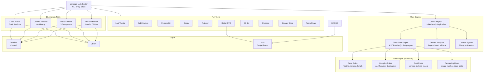
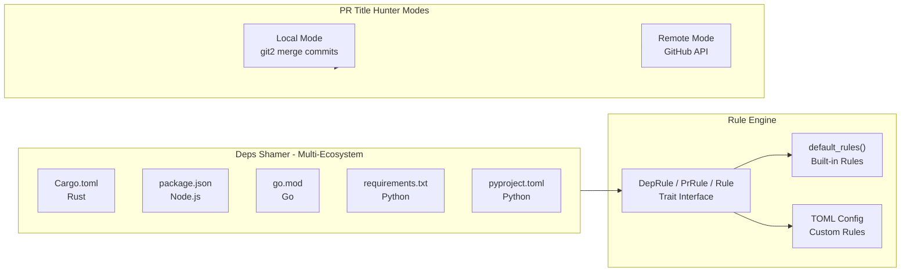

# Garbage Code Hunter

[](https://github.com/TimWood0x10/garbage-code-hunter/actions/workflows/ci.yml)
[](https://crates.io/crates/garbage-code-hunter)
[](https://opensource.org/licenses/Apache-2.0)
[](https://www.rust-lang.org/)

[English](README.md) | [中文](./README_zh.md)

A humorous code quality detector that roasts your garbage code with style!

> **Inspiration**: https://github.com/Done-0/fuck-u-code.git

## What is this?

Garbage Code Hunter is a CLI toolkit for code quality analysis. Unlike traditional linters that give you dry warnings, we tell you how bad your code is in a **sarcastic witty and brutally honest** way.

> **Disclaimer**: This is an **entertainment tool**, not a static analyzer or bug detector. It checks **code style and readability** — naming conventions, nesting depth, duplication, etc. It does **NOT** find bugs, security vulnerabilities, logic errors, or performance issues. A "Terrible" score doesn't mean your code is broken; a "Clean" score doesn't mean your code is correct. For real code quality assurance, use proper static analysis tools (clippy, ESLint, Pylint, etc.).

## Tool Collection

| Tool | Command | Alias | What it does |
|---|---|---|---|
| **Code Hunter** | `analyze` (default) | - | Static analysis: naming, nesting, unwrap abuse, duplication |
| **Commit Roaster** | `commit-roaster` | `cr` | Roast bad commit messages from git history |
| **Deps Shamer** | `deps-shamer` | `ds` | Shame bad dependency practices |
| **PR Title Hunter** | `pr-title-hunter` | `pr` | Roast low-quality PR titles |
| **Full Scan** | `scan` | - | Run all tools, get combined score |
| **Badge** | `badge` | - | Generate SVG score badge |
| **Trend** | `trend` | - | Show quality score trend over time |
| **Last Words** | `last-words` | `lw` | Find legacy TODO/FIXME/HACK comments and their age |
| **Debt Invoice** | `debt-invoice` | `debt` | Generate a technical debt invoice with cost estimates |
| **Personality** | `personality` | - | Analyze your developer personality based on code patterns |
| **Decay** | `decay` | - | Analyze project quality decay over git history |
| **Autopsy** | `autopsy` | - | Generate a code autopsy report (root cause analysis) |
| **Radar** | `radar` | - | Generate a code smell radar chart (SVG) |
| **CI Bot** | `ci-bot` | - | Generate a CI-style PR review comment |
| **Persona** | `persona` | - | Analyze code with a specific roast personality |
| **Danger Zone** | `danger-zone` | `dz` | Identify the most dangerous files in the codebase |
| **Team Roast** | `team-roast` | - | Per-developer team analysis and roasting |

## Architecture





## Features

- **18 tools**: Static analysis, git roasting, dependency shaming, PR review, and 11 entertainment tools
- **Multi-ecosystem deps**: Cargo.toml, package.json, go.mod, requirements.txt, pyproject.toml
- **GitHub API**: PR Title Hunter supports remote repos (`--repo owner/repo`)
- **Historical trends**: Track quality over time with ASCII charts
- **SVG badges**: Generate shields.io-style badges for READMEs
- **Code smell radar**: SVG radar chart for README visualization
- **Developer personality**: Profile your coding style with fun personas
- **Technical debt invoice**: Estimate the real cost of your code smells
- **Code autopsy**: Root cause analysis of codebase problems
- **Danger zone**: Identify the riskiest files by churn, complexity, and contributors
- **Team roast**: Per-developer analysis with commit habit roasting
- **CI comment bot**: Generate PR review comments for GitHub Actions
- **Multiple personas**: Roast as Linux Kernel Maintainer, Silicon Valley CTO, Japanese Enterprise Engineer, or Rust Evangelist
- **Context-aware**: Adjusts sensitivity for test/example/UI code
- **Dual output**: Colored terminal or JSON for all commands
- **Bilingual**: English and Chinese roasts
- **LLM powered**: Optional Ollama integration for creative roasts
- **VSCode extension**: Real-time analysis in your editor
- **11 languages**: Rust, C, C++, Python, JavaScript, TypeScript, Go, Java, Ruby, Swift, Zig

## Scoring System

Score starts at 0 (best). Higher score = worse code quality. Range: 0-100.

### Why Two Tiers?

Issues have different **confidence levels**. A deep-nested function is almost always a real problem; a "single-letter variable" might be fine in a loop. Mixing them together would overweight noisy issues.

| Tier | What | Confidence | Examples |
|------|------|:----------:|----------|
| **Tier 1: Nuclear** | Structural problems | High | deep-nesting, god-function, bare-except |
| **Tier 2: Noisy** | Style / pattern issues | Low | magic-number, naming, println-debugging |

### How It Works

```
Tier 1 (Nuclear):  log2(1 + count) × 8,       cap 40
Tier 2 (Noisy):    log2(1 + density) × 6,      cap 60
                   density = (spicy×1.5 + mild) / thousands_of_lines
Total = Tier1 + Tier2
```

**Why log?** Prevents count explosion. Linear: 100 issues is 10× worse than 10. Log: only 2× worse. More fair — 100 magic numbers shouldn't be 10× worse than 10.

**Why density for Tier 2?** 50 naming issues in a 100K-line project vs 50 in a 100-line project — the latter is clearly worse. Density (per 1K lines) removes project size bias.

### Worked Example

```
Input: 28 nuclear, 58 spicy, 622 mild, 24458 lines

Tier 1: log2(1+28) × 8 = log2(29) × 8 = 4.86 × 8 = 38.9
        → 28 nuclear issues, nearly maxed out at 40

Tier 2: density = (58×1.5 + 622) / 24.458 = 709 / 24.458 = 29.0
        log2(1+29) × 6 = log2(30) × 6 = 4.91 × 6 = 29.4

Total: 38.9 + 29.4 = 68.3 → "Poor"
```

### Quality Levels

| Score Range | Level | Emoji |
|:-----------:|-------|:-----:|
| 0 - 20 | Excellent | 🏆 |
| 21 - 40 | Good | 👍 |
| 41 - 60 | Average | 😐 |
| 61 - 80 | Poor | 😞 |
| 81+ | Terrible | 💀 |

### Categories (informational)

Category scores use `log2(1 + density_per_1k_lines) × 6`, capped at 20 each. They are **informational only** — independent from the total score.

| Category | Rules |
|----------|-------|
| **naming** | terrible-naming, single-letter-variable, meaningless-naming, hungarian-notation, abbreviation-abuse |
| **complexity** | deep-nesting, long-function, god-function, cyclomatic-complexity, complex-closure |
| **duplication** | code-duplication, cross-file-duplication |
| **code-smells** | magic-number, commented-code, dead-code, file-too-long, unwrap-abuse, unnecessary-clone, string-abuse, vec-abuse, macro-abuse, and more |
| **student-code** | println-debugging, panic-abuse, todo-comment, todo-fixme, todo-bug, todo-hack |

## How to Play

### Level 1: Quick Roast (30 seconds)
```bash
# Install
cargo install garbage-code-hunter

# Analyze current project — get roasted immediately
garbage-code-hunter

# Chinese mode
garbage-code-hunter --lang zh-CN
```

### Level 2: Full Scan (2 minutes)
```bash
# Run ALL 18 tools — get a combined garbage score
garbage-code-hunter scan

# Save to history for trend tracking
garbage-code-hunter scan --save

# Check your score trend
garbage-code-hunter trend
```

### Level 3: Deep Dive (5 minutes)
```bash
# Roast your commit history
garbage-code-hunter cr --limit 100

# Shame your dependencies
garbage-code-hunter ds

# Find your worst files
garbage-code-hunter dz

# Generate a radar chart
garbage-code-hunter radar --output radar.svg
```

### Level 4: Team Battle
```bash
# Who's the worst committer?
garbage-code-hunter team-roast

# What's your developer personality?
garbage-code-hunter personality

# Generate a technical debt invoice
garbage-code-hunter debt-invoice
```

### Level 5: CI Integration
```bash
# Generate PR review comments
garbage-code-hunter ci-bot -f json

# Generate a score badge for your README
garbage-code-hunter badge -o badge.svg
```

## Real Project Reports

### Self-Analysis: garbage-code-hunter (this project)

```
📊 Garbage Scan Report
━━━━━━━━━━━━━━━━━━━━━━━━━━━━━━━━━━━━━━━━━━━━━━━━━━

  code-hunter       0/100   (44,836 issues in 93 files)
  commit-roaster   57/100   (50 commits analyzed)
  deps-shamer     100/100   (29 dependencies — clean!)
  pr-title-hunter 100/100   (0 PRs checked)
  last-words       64/100   (7,085 TODO/FIXME found)
  debt-invoice      0/100   ($89,069 estimated debt)
  personality       0/100   (The Copy-Paste Artist)
  decay            50/100   (Declining)
  autopsy          97/100   (1 root cause found)
  radar            58/100   (6 dimensions scored)
  danger-zone      52/100   (10 dangerous files)
  team-roast       98/100   (2 team members)

  Overall Score: 39/100 (Grade: B)
```

**Developer Personality**: The Copy-Paste Artist
> "Ctrl+C, Ctrl+V is your IDE's most used shortcut. Why abstract when you can duplicate?"

**Code Smell Radar**:
```
  Complexity         100 ████████████████████
  Duplication        100 ████████████████████
  Naming              30 ██████
  Panic Risk          20 ████
  Dep Hell             0
  Legacy Smell       100 ████████████████████
```

**Team Stats**:
```
  #1 Timwood0x10    53 commits | 36% fix rate | worst: "fix ci"
  #2 Marky-Shi       5 commits | 60% fix rate | worst: "fix: Add debugging..."
```

**Top 5 Most Dangerous Files**:
```
  1. mod.rs           (6,352 issues — i18n roast messages)
  2. rust_rules.rs    (2,260 issues — tree-sitter rules)
  3. complex_rules.rs (2,050 issues — complex patterns)
  4. display.rs       (1,997 issues — report formatting)
  5. duplication.rs   (1,804 issues — dup detection)
```

### Example: Rust Project Analysis

```bash
$ garbage-code-hunter --lang zh-CN src/

🗑️  垃圾代码猎人 🗑️
正在准备吐槽你的代码...

📊 垃圾代码检测报告
──────────────────────────────────────────────────
📈 问题统计:
   12 🔥 核弹级问题 (需要立即修复)
  228 🌶️  辣眼睛问题 (建议修复)
  44596 😐 轻微问题 (可以忽略)

🏆 代码质量评分: 30.0/100 👍 (良好)
📏 代码行数: 22,946 | 📁 文件: 93 | 🔍 密度: 19 问题/千行
```

### JSON Output (for CI/CD integration)

```bash
$ garbage-code-hunter scan -f json | jq '.overall_score'
39.18

$ garbage-code-hunter cr -f json | jq '.score'
57.0

$ garbage-code-hunter ds -f json | jq '.issues | length'
0
```

## Quick Start

### Install

```bash
cargo install garbage-code-hunter
```

### Subcommands

#### Code Analysis (default)
```bash
garbage-code-hunter                    # Analyze current directory
garbage-code-hunter src/main.rs        # Analyze specific file
garbage-code-hunter --lang zh-CN src/  # Chinese roasts
garbage-code-hunter --markdown src/    # Markdown report for AI tools
garbage-code-hunter --educational      # Show how-to-fix advice
garbage-code-hunter --hall-of-shame    # Show worst files ranking
```

#### Commit Roaster
```bash
garbage-code-hunter commit-roaster              # Last 50 commits
garbage-code-hunter cr --limit 100              # Last 100 commits
garbage-code-hunter cr --author "john" --since 2024-01-01
garbage-code-hunter cr -f json                  # JSON output
```

#### Deps Shamer
```bash
garbage-code-hunter deps-shamer          # Current directory
garbage-code-hunter ds /path/to/project  # Specific project
garbage-code-hunter ds -f json           # JSON output
```

#### PR Title Hunter
```bash
# Local mode (from merge commits)
garbage-code-hunter pr --limit 100

# Remote mode (GitHub API)
garbage-code-hunter pr --repo owner/repo
garbage-code-hunter pr --repo owner/repo --state open --limit 50
garbage-code-hunter pr --repo owner/repo --token $GITHUB_TOKEN
garbage-code-hunter pr --repo owner/repo --author "username"
```

#### Full Scan
```bash
garbage-code-hunter scan              # Run all tools
garbage-code-hunter scan --save       # Run and save to history
garbage-code-hunter scan -f json      # JSON output
```

#### Badge
```bash
garbage-code-hunter badge                         # Auto-score + badge.svg
garbage-code-hunter badge --score 72              # Use specific score
garbage-code-hunter badge -o quality.svg          # Custom output path
garbage-code-hunter badge --style plastic         # Plastic style
```

#### Trend
```bash
garbage-code-hunter trend              # Show last 10 scans
garbage-code-hunter trend --last 20    # Show last 20 scans
garbage-code-hunter trend -f json      # JSON output
```

#### Last Words
```bash
garbage-code-hunter last-words         # Find TODO/FIXME/HACK comments
garbage-code-hunter lw --age           # Include age via git blame (slower)
garbage-code-hunter lw -f json         # JSON output
```

#### Debt Invoice
```bash
garbage-code-hunter debt-invoice       # Generate cost estimate
garbage-code-hunter debt -f json       # JSON output
```

#### Personality
```bash
garbage-code-hunter personality        # Analyze developer personality
garbage-code-hunter personality -f json
```

#### Decay
```bash
garbage-code-hunter decay              # Analyze quality over git history
garbage-code-hunter decay -f json
```

#### Autopsy
```bash
garbage-code-hunter autopsy            # Root cause analysis
garbage-code-hunter autopsy -f json
```

#### Radar
```bash
garbage-code-hunter radar              # Show code smell radar
garbage-code-hunter radar --output radar.svg  # Generate SVG chart
```

#### CI Bot
```bash
garbage-code-hunter ci-bot             # Generate PR review comment
garbage-code-hunter ci-bot -f json     # JSON with Markdown comment
```

#### Persona
```bash
garbage-code-hunter persona --persona linux-kernel
garbage-code-hunter persona --persona silicon-valley
garbage-code-hunter persona --persona japanese-enterprise
garbage-code-hunter persona --persona rust-fanatic
```

#### Danger Zone
```bash
garbage-code-hunter danger-zone        # Find most dangerous files
garbage-code-hunter dz -f json
```

#### Team Roast
```bash
garbage-code-hunter team-roast         # Per-developer analysis
garbage-code-hunter team-roast --limit 200
```

### Output Formats

All subcommands support `terminal` (default, colored) and `json` output:
```bash
garbage-code-hunter cr -f json | jq '.score'
garbage-code-hunter ds -f json | jq '.issues | length'
garbage-code-hunter trend -f json | jq '.records[-1].overall_score'
```

## Example Output

### Commit Roaster
```
Commit Roast Report
━━━━━━━━━━━━━━━━━━━━━━━━━━━━━━━━━━━━━━━━━━
Scanned 50 commits, found 12 issues

Critical (2)
  * abc1234 "" -- The commit message is empty. Were you sleepwalking?
  * def5678 "asdf" -- Keyboard mashing is not a commit strategy.

High (5)
  * ghi9012 "fix" -- Fix WHAT? 'fix' is not a description, it's a cry for help.

Score: 76/100 (B)
```

### Trend
```
Quality Trend
  (showing last 5 scans)

  Score
    85 |   ●
       |   |
    80 | --+
       |
        05-01  05-08  05-13

Breakdown
  Overall              75 -> 85 (+10) UP
  code-hunter          65 -> 78 (+13) UP
  commit-roaster       80 -> 82 (+2)  RIGHT

Recent Scans
  2026-05-13T10:00:00  85  .
  2026-05-08T14:30:00  80  .
  2026-05-01T09:00:00  75  .
```

### Full Scan
```
Running Full Garbage Scan...
━━━━━━━━━━━━━━━━━━━━━━━━━━━━━━━━━━━━━━━━━━━━━━━━━━
  code-hunter: 72/100 (23 issues in 15 files)
  commit-roaster: 85/100 (50 commits analyzed)
  deps-shamer: 90/100 (45 dependencies)
  pr-title-hunter: 95/100 (30 PRs checked)

Garbage Report
━━━━━━━━━━━━━━━━━━━━━━━━━━━━━━━━━━━━━━━━━━━━━━━━━━

  Tool Summary
  code-hunter          72/100  (23 items)
  commit-roaster       85/100  (50 items)
  deps-shamer          90/100  (45 items)
  pr-title-hunter      95/100  (30 items)

  Overall Garbage Score: 86/100
```

## Excluding Generated Files

Generated files (protobuf, bundles, vendored code) can produce thousands of false positives. Exclude them via `.garbage-code-hunter.toml` in your project root:

```toml
[whitelists]
exclude_patterns = [
    "*.pb.go",           # Generated protobuf Go
    "*.pulsar.go",       # Generated pulsar Go
    "*_grpc.pb.go",      # Generated gRPC Go
    "*.gen.ts",          # Generated TypeScript
    "*.generated.*",     # Any generated files
    "*.min.js",          # Minified JS
    "*.bundle.js",       # Bundled JS
    ".venv/",            # Python venv
    "venv/",
    "__pycache__/",
    "vendor/",           # Vendored dependencies
    "third_party/",
]
```

The tool also has **built-in defaults** that are always excluded: `target/`, `node_modules/`, `.git/`, `.svn/`, `build/`, `dist/`, `out/`, `__pycache__/`, `.DS_Store`, `.venv/`, `venv/`, `vendor/`.

### CLI exclusion (per-run)

For one-off runs, use `--exclude`:

```bash
garbage-code-hunter --exclude "*.pb.go" --exclude "generated/"
garbage-code-hunter --exclude "vendor/*" --exclude "*.gen.ts"
```

## Tool Details

### Code Hunter Rules (Rust)
- Single-letter variable names
- Meaningless names (data, temp, foo, bar)
- Deep nesting (>4 levels)
- Long functions (>50 lines)
- `unwrap()` abuse
- Magic numbers
- Duplicate code blocks
- Cross-file duplication detection
- Context-aware: reduced sensitivity for test/example code

### Commit Roaster Rules
- Empty messages, single-word commits
- WIP commits on shared branches
- Generic messages: "fix", "update", "change"
- Keyboard mashing (asdf, qwer)
- ALL CAPS, excessive exclamation marks
- Version bump only, default merge messages
- Configurable via TOML rule files

### Deps Shamer Rules
- Too many dependencies (>50)
- Git-based dependencies
- Wildcard or star versions
- Pre-release versions in production
- Deprecated packages (per-ecosystem lists)
- Duplicate dependencies
- Too many dev/optional deps

### PR Title Hunter Rules
- Empty or too-short titles (<5 chars)
- Generic titles ("fix", "update", "WIP")
- Ticket-only titles ("PROJ-123", "#456")
- ALL CAPS, excessive exclamation marks
- Keyboard mashing
- Lowercase start (skips conventional commits)

## VSCode Extension

Get real-time roasting in VSCode:

1. Install the `garbage-code-hunter` CLI
2. Search "Garbage Code Hunter" in VSCode marketplace
3. Analysis triggers automatically when you save Rust files

## License

Apache License 2.0

---

**Remember**: We roast the code, not you. Let's make code reviews a bit more fun!
