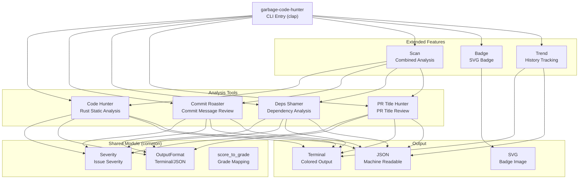
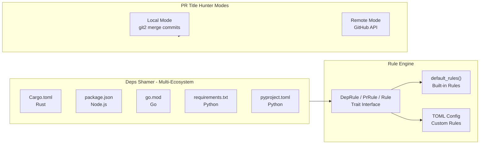

# Garbage Code Hunter

[](https://github.com/yourusername/garbage-code-hunter/actions/workflows/ci.yml)
[](https://crates.io/crates/garbage-code-hunter)
[](https://opensource.org/licenses/Apache-2.0)
[](https://www.rust-lang.org/)

[English](README.md) | [中文](./README_zh.md)

A humorous code quality detector that roasts your garbage code with style!

> **Inspiration**: https://github.com/Done-0/fuck-u-code.git

## What is this?

Garbage Code Hunter is a CLI toolkit for code quality analysis. Unlike traditional linters that give you dry warnings, we tell you how bad your code is in a **sarcastic witty and brutally honest** way.

## Tool Collection

| Tool | Command | Alias | What it does |
|---|---|---|---|
| **Code Hunter** | `analyze` (default) | - | Static analysis: naming, nesting, unwrap abuse, duplication |
| **Commit Roaster** | `commit-roaster` | `cr` | Roast bad commit messages from git history |
| **Deps Shamer** | `deps-shamer` | `ds` | Shame bad dependency practices |
| **PR Title Hunter** | `pr-title-hunter` | `pr` | Roast low-quality PR titles |
| **Full Scan** | `scan` | - | Run all tools, get combined score |
| **Badge** | `badge` | - | Generate SVG score badge |
| **Trend** | `trend` | - | Show quality score trend over time |

## Architecture





## Features

- **Multi-tool analysis**: 4 independent tools covering code, commits, deps, and PRs
- **Multi-ecosystem deps**: Cargo.toml, package.json, go.mod, requirements.txt, pyproject.toml
- **GitHub API**: PR Title Hunter supports remote repos (`--repo owner/repo`)
- **Historical trends**: Track quality over time with ASCII charts
- **SVG badges**: Generate shields.io-style badges for READMEs
- **Context-aware**: Adjusts sensitivity for test/example/UI code
- **Severity-weighted scoring**: 0-100 scale per tool with penalty system
- **Dual output**: Colored terminal or JSON for all commands
- **Bilingual**: English and Chinese roasts
- **LLM powered**: Optional Ollama integration for creative roasts
- **VSCode extension**: Real-time analysis in your editor

## Quick Start

### Install

```bash
cargo install garbage-code-hunter
```

### Subcommands

#### Code Analysis (default)
```bash
garbage-code-hunter                    # Analyze current directory
garbage-code-hunter src/main.rs        # Analyze specific file
garbage-code-hunter --lang zh-CN src/  # Chinese roasts
garbage-code-hunter --markdown src/    # Markdown report for AI tools
garbage-code-hunter --educational      # Show how-to-fix advice
garbage-code-hunter --hall-of-shame    # Show worst files ranking
```

#### Commit Roaster
```bash
garbage-code-hunter commit-roaster              # Last 50 commits
garbage-code-hunter cr --limit 100              # Last 100 commits
garbage-code-hunter cr --author "john" --since 2024-01-01
garbage-code-hunter cr -f json                  # JSON output
```

#### Deps Shamer
```bash
garbage-code-hunter deps-shamer          # Current directory
garbage-code-hunter ds /path/to/project  # Specific project
garbage-code-hunter ds -f json           # JSON output
```

#### PR Title Hunter
```bash
# Local mode (from merge commits)
garbage-code-hunter pr --limit 100

# Remote mode (GitHub API)
garbage-code-hunter pr --repo owner/repo
garbage-code-hunter pr --repo owner/repo --state open --limit 50
garbage-code-hunter pr --repo owner/repo --token $GITHUB_TOKEN
garbage-code-hunter pr --repo owner/repo --author "username"
```

#### Full Scan
```bash
garbage-code-hunter scan              # Run all tools
garbage-code-hunter scan --save       # Run and save to history
garbage-code-hunter scan -f json      # JSON output
```

#### Badge
```bash
garbage-code-hunter badge                         # Auto-score + badge.svg
garbage-code-hunter badge --score 72              # Use specific score
garbage-code-hunter badge -o quality.svg          # Custom output path
garbage-code-hunter badge --style plastic         # Plastic style
```

#### Trend
```bash
garbage-code-hunter trend              # Show last 10 scans
garbage-code-hunter trend --last 20    # Show last 20 scans
garbage-code-hunter trend -f json      # JSON output
```

### Output Formats

All subcommands support `terminal` (default, colored) and `json` output:
```bash
garbage-code-hunter cr -f json | jq '.score'
garbage-code-hunter ds -f json | jq '.issues | length'
garbage-code-hunter trend -f json | jq '.records[-1].overall_score'
```

## Example Output

### Commit Roaster
```
Commit Roast Report
━━━━━━━━━━━━━━━━━━━━━━━━━━━━━━━━━━━━━━━━━━
Scanned 50 commits, found 12 issues

Critical (2)
  * abc1234 "" -- The commit message is empty. Were you sleepwalking?
  * def5678 "asdf" -- Keyboard mashing is not a commit strategy.

High (5)
  * ghi9012 "fix" -- Fix WHAT? 'fix' is not a description, it's a cry for help.

Score: 76/100 (B)
```

### Trend
```
Quality Trend
  (showing last 5 scans)

  Score
    85 |   ●
       |   |
    80 | --+
       |
        05-01  05-08  05-13

Breakdown
  Overall              75 -> 85 (+10) UP
  code-hunter          65 -> 78 (+13) UP
  commit-roaster       80 -> 82 (+2)  RIGHT

Recent Scans
  2026-05-13T10:00:00  85  .
  2026-05-08T14:30:00  80  .
  2026-05-01T09:00:00  75  .
```

### Full Scan
```
Running Full Garbage Scan...
━━━━━━━━━━━━━━━━━━━━━━━━━━━━━━━━━━━━━━━━━━━━━━━━━━
  code-hunter: 72/100 (23 issues in 15 files)
  commit-roaster: 85/100 (50 commits analyzed)
  deps-shamer: 90/100 (45 dependencies)
  pr-title-hunter: 95/100 (30 PRs checked)

Garbage Report
━━━━━━━━━━━━━━━━━━━━━━━━━━━━━━━━━━━━━━━━━━━━━━━━━━

  Tool Summary
  code-hunter          72/100  (23 items)
  commit-roaster       85/100  (50 items)
  deps-shamer          90/100  (45 items)
  pr-title-hunter      95/100  (30 items)

  Overall Garbage Score: 86/100
```

## Tool Details

### Code Hunter Rules (Rust)
- Single-letter variable names
- Meaningless names (data, temp, foo, bar)
- Deep nesting (>4 levels)
- Long functions (>50 lines)
- `unwrap()` abuse
- Magic numbers
- Duplicate code blocks
- Cross-file duplication detection
- Context-aware: reduced sensitivity for test/example code

### Commit Roaster Rules
- Empty messages, single-word commits
- WIP commits on shared branches
- Generic messages: "fix", "update", "change"
- Keyboard mashing (asdf, qwer)
- ALL CAPS, excessive exclamation marks
- Version bump only, default merge messages
- Configurable via TOML rule files

### Deps Shamer Rules
- Too many dependencies (>50)
- Git-based dependencies
- Wildcard or star versions
- Pre-release versions in production
- Deprecated packages (per-ecosystem lists)
- Duplicate dependencies
- Too many dev/optional deps

### PR Title Hunter Rules
- Empty or too-short titles (<5 chars)
- Generic titles ("fix", "update", "WIP")
- Ticket-only titles ("PROJ-123", "#456")
- ALL CAPS, excessive exclamation marks
- Keyboard mashing
- Lowercase start (skips conventional commits)

## VSCode Extension

Get real-time roasting in VSCode:

1. Install the `garbage-code-hunter` CLI
2. Search "Garbage Code Hunter" in VSCode marketplace
3. Analysis triggers automatically when you save Rust files

## License

Apache License 2.0

---

**Remember**: We roast the code, not you. Let's make code reviews a bit more fun!
