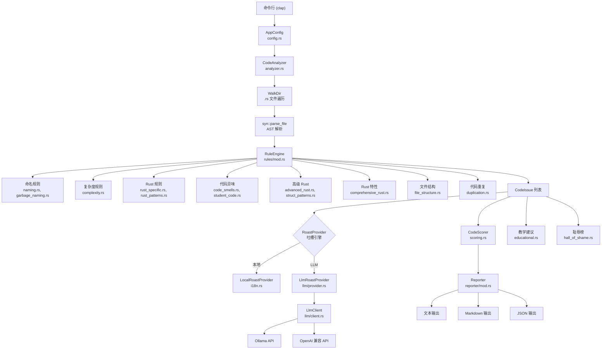

# 🗑️ Garbage Code Hunter

[English](README.md) | [中文](README_zh.md)

[](https://www.rust-lang.org)
[](LICENSE)
[](https://crates.io/crates/garbage-code-hunter)
[]()

一个幽默的 Rust 代码质量检测工具，用最毒舌的方式吐槽你的垃圾代码！🔥

*你见过最毒舌的 Rust 静态分析助手* 🎭   让编码更有趣，享受编程的乐趣 😏.

```
灵感来源: https://github.com/Done-0/fuck-u-code.git
```

不同于传统 linter 给你干巴巴的警告，Garbage Code Hunter 用**毒舌、机智、毫不留情**的方式告诉你代码有多烂。就像一个不怕伤你自尊的毒舌代码审查员（当然是为你好）。

## ✨ 功能特性

- 🎭 **幽默代码分析**: 在学习更好的编码实践的同时被花式吐槽
- 🗣️ **毒舌点评**: 机智且有教育意义的反馈，让代码审查变得有趣
- 🌍 **多语言支持**: 支持中文和英文（更多语言即将到来！）
- 🎯 **智能检测**: 识别常见代码异味和反模式
- 🎲 **随机吐槽**: 每次运行都有不同的毒舌评论
- 📊 **专业报告**: 生成多格式的详细分析报告
- 🔧 **高度可配置**: 自定义输出、过滤和分析深度
- 📝 **Markdown 导出**: 适合文档和 CI/CD 集成
- 🚀 **快速轻量**: 使用 Rust 构建，极致性能
- 🤖 **LLM 毒舌引擎**: 通过 Ollama 或 OpenAI 兼容 API 使用本地 LLM 生成上下文感知的创意吐槽

### 🆕 **增强功能**

- 🎓 **教学模式**: 提供代码示例和最佳实践的详细解释
- 🏆 **耻辱榜**: 项目统计和最差文件排名
- 💡 **智能建议**: 基于检测结果的针对性改进建议
- 📈 **高级评分**: 包含分类细分的综合质量指标
- 🎨 **精美界面**: 卡片式布局，带进度条和视觉指示器
- 🔍 **文件结构分析**: 检测过长文件、导入混乱和深层模块嵌套

## 🏗️ 系统架构



## 🎯 检测功能

### 📝 **命名规范检查**

- **糟糕命名**: 检测无意义的变量名
- **单字母变量**: 查找过度使用的单字母变量
- **无意义命名**: 识别占位符名称如 `foo`、`bar`、`data`、`temp`
- **匈牙利命名法**: 检测过时的命名如 `strName`、`intCount`
- **缩写滥用**: 发现令人困惑的缩写如 `mgr`、`ctrl`、`usr`、`pwd`

### 🔧 **代码复杂度分析**

- **深层嵌套**: 检测超过 5 层的嵌套
- **过长函数**: 查找行数过多的函数
- **上帝函数**: 识别做太多事情的过度复杂函数

### 🦀 **Rust 特有问题**

- **unwrap 滥用**: 检测不安全的 unwrap() 使用
- **不必要的 clone**: 查找可避免的 clone() 调用
- **String 滥用**: 识别应该使用 `&str` 而不是 `String` 的地方
- **Vec 滥用**: 检测不必要的 Vec 分配

### 💩 **代码异味检测**

- **魔法数字**: 检测硬编码的数字常量
- **注释代码**: 查找大块的注释代码
- **死代码**: 识别不可达代码

### 🎓 **学生代码模式**

- **printf 调试**: 检测遗留的调试打印语句
- **panic 滥用**: 查找随意的 panic! 使用
- **TODO 注释**: 统计过多的 TODO/FIXME 注释

### 🔄 **其他检测**

- **代码重复**: 查找重复的代码块
- **宏滥用**: 检测过度的宏使用
- **高级 Rust 模式**: 复杂闭包、生命周期滥用等

### 🏗️ **文件结构分析**

- **文件长度**: 检测过长的文件（>1000 行）
- **导入混乱**: 识别无序和重复的导入
- **模块嵌套**: 检测过深的模块层级
- **项目组织**: 分析整体代码结构质量

## 📊 检测规则统计

本工具目前包含 **20+ 条检测规则**，涵盖以下类别：

| 类别               | 规则数量 | 描述                     |
| ------------------ | -------- | ------------------------ |
| **命名规范** | 5        | 各种命名问题检测         |
| **代码复杂度** | 3        | 代码结构复杂度分析       |
| **Rust 特有** | 4        | Rust 语言特定的问题模式  |
| **代码异味** | 4        | 通用代码质量问题         |
| **学生代码** | 3        | 常见的初学者代码模式     |
| **文件结构** | 3        | 文件组织和导入分析       |
| **其他**     | 5+       | 代码重复、宏滥用等       |

**总计: 25+ 条规则** 主动检测 Rust 项目中的垃圾代码模式！🗑️

## 🎯 评分系统

Garbage Code Hunter 包含一个**科学的综合评分系统**，在 **0-100** 的范围内评估你的 Rust 代码质量：

- **分数越低 = 代码质量越好** 🏆
- **分数越高 = 代码问题越多** 💀

### 📊 评分范围与质量等级

| 分数范围 | 质量等级 | Emoji | 描述                         |
| -------- | -------- | ----- | ---------------------------- |
| 0-20     | 优秀     | 🏆    | 出色的代码质量，问题极少     |
| 21-40    | 良好     | 👍    | 良好的代码质量，需要小幅改进 |
| 41-60    | 一般     | 😐    | 一般的代码质量，有改进空间   |
| 61-80    | 较差     | 😟    | 较差的代码质量，建议重构     |
| 81-100   | 糟糕     | 💀    | 严重的代码质量问题，需要重写 |

### 🧮 评分算法

评分系统使用**多因子算法**：

#### 1. **基础分数计算**

每个检测到的问题按以下公式计算基础分：

```
问题分数 = 规则权重 × 严重性权重
```

#### 2. **规则权重**（影响因子）

不同类型的问题基于其影响有不同的权重：

| 类别             | 规则              | 权重 | 理由                 |
| ---------------- | ----------------- | ---- | -------------------- |
| **安全关键** | `unsafe-abuse`  | 5.0  | 内存安全违规         |
| **FFI 关键** | `ffi-abuse`     | 4.5  | 外部函数接口风险     |
| **运行时关键** | `unwrap-abuse`  | 4.0  | 潜在的 panic 源      |
| **架构**     | `lifetime-abuse`| 3.5  | 复杂的生命周期管理   |
| **异步/并发** | `async-abuse`   | 3.5  | 异步模式误用         |
| **复杂度**   | `deep-nesting`  | 3.0  | 代码可维护性         |
| **性能**     | `unnecessary-clone` | 2.0 | 运行时效率       |
| **可读性**   | `terrible-naming`| 2.0 | 代码可理解性       |

#### 3. **严重性权重**

问题按严重性分类，对应不同的乘数：

- **核弹级** (💥): 10.0× - 可能导致崩溃或安全漏洞的严重问题
- **辣眼睛** (🌶️): 5.0× - 影响可维护性或性能的严重问题
- **轻微** (😐): 2.0× - 风格或最佳实践方面的小问题

#### 4. **密度惩罚**

基于问题集中度的额外惩罚：

- **问题密度**: 每 1000 行代码的问题数

  - \>50 问题/千行: +25 惩罚
  - \>30 问题/千行: +15 惩罚
  - \>20 问题/千行: +10 惩罚
  - \>10 问题/千行: +5 惩罚
- **文件复杂度**: 每个文件的平均问题数

  - \>20 问题/文件: +15 惩罚
  - \>10 问题/文件: +10 惩罚
  - \>5 问题/文件: +5 惩罚

#### 5. **严重性分布惩罚**

问题模式的额外惩罚：

- **核弹级问题**: 第一个 +20，之后每个 +5
- **辣眼睛问题**: 超过 5 个后，每个 +2
- **轻微问题**: 超过 20 个后，每个 +0.5

### 📈 包含的指标

评分系统提供详细的指标：

- **总分**: 整体代码质量分数 (0-100)
- **分类分数**: 按问题类别的细分
- **问题密度**: 每 1000 行代码的问题数
- **严重性分布**: 核弹级/辣眼睛/轻微问题的数量
- **文件数量**: 分析的 Rust 文件数
- **总行数**: 分析的代码总行数

### 🔬 科学方法

评分系统的设计原则：

- **客观性**: 基于可度量的代码指标
- **加权**: 严重问题有更高的影响
- **上下文感知**: 考虑代码大小和复杂度
- **可操作**: 提供具体的改进方向
- **一致性**: 跨运行的可重现结果

## 🚀 安装

### 从源码安装

```bash
git clone https://github.com/TimWood0x10/garbage-code-hunter.git
cd garbage-code-hunter
make install
```

### 使用 Cargo 安装

```bash
cargo install garbage-code-hunter
```

## 📖 使用方法

### 基本用法

```bash
# 分析当前目录
cargo run

# 分析指定文件或目录
cargo run -- src/main.rs
cargo run -- src/

# 使用 make 目标
make run ARGS="src/ --verbose"
make demo
```

### 语言选项

```bash
# 中文输出
garbage-code-hunter --lang zh-CN src/

# 英文输出
garbage-code-hunter --lang en-US src/
```

### 高级选项

```bash
# 详细分析，显示前 3 个问题最多的文件
garbage-code-hunter --verbose --top 3 --issues 5 src/

# 只显示摘要
garbage-code-hunter --summary src/

# 生成 Markdown 报告
garbage-code-hunter --markdown src/ > code-quality-report.md

# 排除文件/目录
garbage-code-hunter --exclude "test_*" --exclude "target/*" src/

# 只显示严重问题
garbage-code-hunter --harsh src/
```

### 🆕 增强分析功能

```bash
# 教学模式 - 为每种问题类型提供详细解释和改进建议
cargo run -- src/ --educational

# 耻辱榜 - 显示最差文件和最常见问题的统计
cargo run -- src/ --hall-of-shame

# 智能建议 - 基于实际问题生成针对性改进建议
cargo run -- src/ --suggestions

# 组合功能，生成综合分析报告
cargo run -- src/ --hall-of-shame --suggestions --educational
```

#### 🎓 教学模式 (`--educational`)

为每个检测到的问题提供详细解释：

- **为什么有问题**: 清晰解释问题所在
- **如何修复**: 逐步改进指南
- **代码示例**: 改进前后的代码片段
- **最佳实践**: Rust 文档和指南链接

#### 🏆 耻辱榜 (`--hall-of-shame`)

显示全面的项目统计：

- **最差文件排名**: 问题最多的文件
- **问题频率分析**: 最常见的问题模式
- **项目指标**: 垃圾密度、文件数、总问题数
- **分类细分**: 按类型分组的问题

#### 💡 智能建议 (`--suggestions`)

生成智能的、数据驱动的建议：

- **针对性建议**: 基于你的实际代码问题
- **优先级排序**: 最关键的改进优先
- **可操作步骤**: 具体的、可实施的建议
- **进度跟踪**: 可衡量的改进目标

### 🤖 LLM 毒舌引擎 (`--llm`)

使用本地 LLM 生成创意十足、上下文感知的吐槽消息，替代硬编码的回复。需要 [Ollama](https://ollama.com) 或任何 OpenAI 兼容 API。

```bash
# 使用 Ollama + gemma4（推荐，效果最好）
garbage-code-hunter --llm --llm-model gemma4:e2b --markdown src/

# 使用 Ollama + llama3.2
garbage-code-hunter --llm --llm-model llama3.2 --markdown src/

# 使用 OpenAI 兼容端点（如 LM Studio）
garbage-code-hunter --llm --llm-provider openai-compatible --llm-endpoint http://localhost:1234 --llm-model my-model --markdown src/

# 中文吐槽
garbage-code-hunter --llm --llm-model gemma4:e2b --lang zh-CN --markdown src/
```

**LLM 吐槽示例**（由 gemma4:e2b 生成）：

```
- "嵌套这么深，是想挖到地核吗？这不是结构，这是地质断层线。"
- "变量 'value' - 恭喜你发明了最无意义的标识符"
- "危险的内存操作比我的鲁莽驾驶还多！不安全的代码是定时炸弹。"
- "发现复制粘贴忍者！23 行完全相同的代码。你复制了逻辑而不是抽象它。"
```

**要求：**
- Ollama 在本地运行（默认：`http://localhost:11434`）
- 通过 `ollama pull <model>` 拉取模型（如 `gemma4:e2b`、`llama3.2`）
- OpenAI 兼容提供商：任何实现 `/v1/chat/completions` API 的端点

**注意：** LLM 吐槽在 `--markdown` 输出模式下显示。在文本模式下，工具会回退到本地吐槽以保持紧凑显示。

## 🎨 输出示例

```
🗑️  垃圾代码猎人 🗑️
正在准备吐槽你的代码...

📊 垃圾代码检测报告
──────────────────────────────────────────────────
发现了一些需要改进的地方：

📈 问题统计:
   8 🔥 核弹级问题 (需要立即修复)
   202 🌶️  辣眼睛问题 (建议修复)
   210 😐 轻微问题 (可以忽略)
   420 📝 总计

🏆 代码质量评分
──────────────────────────────────────────────────
   📊 总分: 63.0/100 😞
   🎯 等级: 较差
   📏 代码行数: 512
   📁 文件数量: 2
   🔍 问题密度: 82 问题/千行

   🎭 问题分布:
      💥 核弹级: 8
      🌶️  严重: 202
      😐 轻微: 210

🏆 问题最多的文件
──────────────────────────────────────────────────
   1. func.rs (231 issues)
   2. ultimate_garbage_code_example.rs (189 issues)

📁 func.rs
  📦 嵌套深度问题: 20 (深度嵌套)
  🔄 代码重复问题: 9 (6 instances)
  🏷️ 变量命名问题: 22 (temp, temp, data, data, data, ...)
  ⚠️ println 调试: 1
  🏷️ 变量命名问题: 128 (a, b, c, d, e, ...)

📁 ultimate_garbage_code_example.rs
  📦 嵌套深度问题: 11 (深度嵌套)
  ⚠️ panic 滥用: 1
  🔄 代码重复问题: 5 (多个代码块)
  ⚠️ 上帝函数: 1
  ⚠️ 魔法数字: 16


🏆 代码质量报告
════════════════════════════════════════════════════════════
╭─ 📊 总体评分 ─────────────────────────────────────────╮
│                                                      │
│  总分: 63.0/100  ████████████▒▒▒▒▒▒▒▒  (😞 较差)│
│                                                      │
│  分析文件: 2 个    问题总数: 420 个                   │
│                                                      │
╰──────────────────────────────────────────────────────╯

📋 分类评分详情
────────────────────────────────────────────────────────────
   ⚠ 🏷️ 命名规范 [ 90分] ██████████████████▒▒ 糟糕，急需修复
       💬 变量名的创意程度超越了我的理解 🚀
   ⚠ 🧩 复杂度 [ 90分] ██████████████████▒▒ 糟糕，急需修复
       💬 函数长度已经突破天际 🚀
   ⚠ 🔄 代码重复 [ 90分] ██████████████████▒▒ 糟糕，急需修复
       💬 建议改名为copy-paste.rs 📋
   ✓✓ 🦀 Rust基础 [  0分] ▒▒▒▒▒▒▒▒▒▒▒▒▒▒▒▒▒▒▒▒ 优秀，继续保持
   ✓✓ ⚡ 高级特性 [  0分] ▒▒▒▒▒▒▒▒▒▒▒▒▒▒▒▒▒▒▒▒ 优秀，继续保持
   ⚠ 🚀 Rust功能 [ 90分] ██████████████████▒▒ 糟糕，急需修复
       💬 建议重新学习 Rust 最佳实践 🎓
   ✓✓ 🏗️ 代码结构 [  0分] ▒▒▒▒▒▒▒▒▒▒▒▒▒▒▒▒▒▒▒▒ 优秀，继续保持


📏 评分标准 (分数越高代码越烂)
────────────────────────────────────────
   💀 81-100分: 糟糕，急需重写    🔥 61-80分: 较差，建议重构
   ⚠️  41-60分: 一般，需要改进    ✅ 21-40分: 良好，还有提升空间
   🌟 0-20分: 优秀，继续保持

继续努力，让代码变得更好！🚀
```

## 🛠️ 命令行选项

| 选项                   | 简写         | 描述                                       |
| ---------------------- | ------------ | ------------------------------------------ |
| `--help`             | `-h`       | 显示帮助信息                               |
| `--verbose`          | `-v`       | 显示详细分析报告                           |
| `--top N`            | `-t N`     | 显示问题最多的前 N 个文件（默认：5）       |
| `--issues N`         | `-i N`     | 显示每个文件的 N 个问题（默认：5）         |
| `--summary`          | `-s`       | 只显示摘要结论                             |
| `--markdown`         | `-m`       | 输出 Markdown 格式报告                     |
| `--lang LANG`        | `-l LANG`  | 输出语言（zh-CN, en-US）                   |
| `--exclude PATTERN`  | `-e PATTERN` | 排除文件/目录模式                        |
| `--harsh`            |              | 只显示最严重的问题                         |
| `--suggestions`      |              | 显示优化代码的建议                         |
| `--educational`      |              | 为每种问题类型显示教学建议                 |
| `--hall-of-shame`    |              | 显示耻辱榜（最差文件和模式）               |
| `--llm`              |              | 启用 LLM 吐槽引擎                          |
| `--llm-provider`     |              | LLM 提供商类型：`ollama` 或 `openai-compatible` |
| `--llm-model`        |              | LLM 模型名称（如 `gemma4:e2b`、`llama3.2`）|
| `--llm-endpoint`     |              | LLM API 端点 URL                           |
| `--llm-api-key`      |              | LLM API 密钥（用于 OpenAI 兼容提供商）     |
| `--llm-timeout`      |              | LLM 请求超时时间（秒，默认：30）           |

## 🔧 开发

### 前置要求

- Rust 1.70 或更高版本
- Cargo

### 构建

```bash
# Debug 构建
make build

# Release 构建
make release

# 运行测试
make test

# 格式化代码
make fmt

# 运行 linter
make clippy
```

### 运行演示

```bash
make demo
```

这会创建一个故意写得很烂的示例文件并运行分析器。

## 🎯 示例

### CI/CD 集成

```yaml
# GitHub Actions 示例
- name: Code Quality Check
  run: |
    cargo install garbage-code-hunter
    garbage-code-hunter --markdown --lang zh-CN src/ > quality-report.md
    # 将报告作为制品上传或在 PR 上评论
```

### Pre-commit Hook

```bash
#!/bin/bash
# .git/hooks/pre-commit
garbage-code-hunter --harsh --summary src/
if [ $? -ne 0 ]; then
    echo "检测到代码质量问题，请在提交前修复。"
    exit 1
fi
```

## 🤝 贡献

欢迎贡献！以下是你可以帮助的方式：

1. **添加新规则**: 实现额外的代码异味检测
2. **语言支持**: 添加更多语言的翻译
3. **改进消息**: 让吐槽更有趣（但仍然有帮助）
4. **文档**: 帮助改进文档和示例
5. **Bug 报告**: 发现了 bug？告诉我们！

### 添加新检测规则

1. 在 `src/rules/` 中创建新规则
2. 实现 `Rule` trait
3. 在 `src/i18n.rs` 中添加幽默消息
4. 添加测试
5. 提交 PR！

## 📝 许可证

本项目基于 Apache License 2.0 - 详见 [LICENSE](LICENSE) 文件。

## 🙏 致谢

- 受到更有趣的代码审查需求的启发
- 用 ❤️ 和大量 ☕ 构建
- 感谢所有写垃圾代码的开发者（我们都经历过！）

## 🔗 链接

- [文档](https://docs.rs/garbage-code-hunter)
- [Crates.io](https://crates.io/crates/garbage-code-hunter)
- [GitHub 仓库](https://github.com/TimWood0x10/garbage-code-hunter)
- [问题追踪](https://github.com/TimWood0x10/garbage-code-hunter/issues)

---

**记住**: 目标不是羞辱开发者，而是让代码质量改进变得有趣和难忘。编码愉快！🚀
