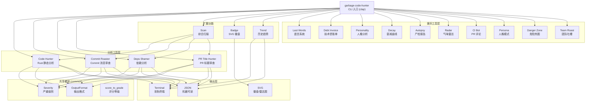
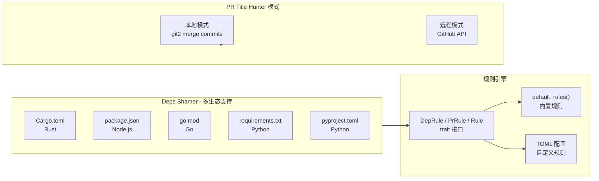

# Garbage Code Hunter

[English](./README.md) | [中文](README_zh.md)

一个幽默的代码质量检测工具集，用最毒舌的方式吐槽你的垃圾代码！

> **灵感来源**: https://github.com/Done-0/fuck-u-code.git

## 这是什么？

Garbage Code Hunter 是一个 CLI 工具集，用于代码质量分析。不同于传统 linter 给你干巴巴的警告，我们用**毒舌、机智、毫不留情**的方式告诉你代码有多烂。

## 工具全家桶

| 工具 | 命令 | 别名 | 功能 |
|---|---|---|---|
| **Code Hunter** | `analyze`（默认） | - | 静态分析：命名、嵌套、unwrap 滥用、重复代码 |
| **Commit Roaster** | `commit-roaster` | `cr` | 吐槽 git 历史中的烂 commit 消息 |
| **Deps Shamer** | `deps-shamer` | `ds` | 羞耻依赖管理：烂版本号、过时包、git 依赖 |
| **PR Title Hunter** | `pr-title-hunter` | `pr` | 吐槽低质量 PR 标题（本地 + GitHub） |
| **Full Scan** | `scan` | - | 跑所有工具，输出综合评分 |
| **Badge** | `badge` | - | 生成 SVG 评分徽章 |
| **Trend** | `trend` | - | 查看质量评分历史趋势 |
| **Last Words** | `last-words` | `lw` | 发现遗留的 TODO/FIXME/HACK 注释及其存活天数 |
| **Debt Invoice** | `debt-invoice` | `debt` | 生成技术债账单，估算维护成本 |
| **Personality** | `personality` | - | 分析你的开发者人格画像 |
| **Decay** | `decay` | - | 分析项目质量随 git 历史的衰减曲线 |
| **Autopsy** | `autopsy` | - | 代码尸检报告：根因分析 |
| **Radar** | `radar` | - | 代码气味雷达图（SVG） |
| **CI Bot** | `ci-bot` | - | 生成 CI 风格的 PR 审查评论 |
| **Persona** | `persona` | - | 用特定人格模式吐槽代码 |
| **Danger Zone** | `danger-zone` | `dz` | 找出最危险的文件 |
| **Team Roast** | `team-roast` | - | 按开发者分析，团队吐槽 |

## 架构图





## 特性一览

- **18 个工具**：静态分析、git 吐槽、依赖羞耻、PR 审查 + 11 个娱乐工具
- **多生态依赖**：Cargo.toml、package.json、go.mod、requirements.txt、pyproject.toml
- **GitHub API**：PR Title Hunter 支持远程仓库（`--repo owner/repo`）
- **历史趋势**：用 ASCII 图表追踪质量变化
- **SVG 徽章**：生成 shields.io 风格徽章嵌入 README
- **代码气味雷达**：SVG 雷达图可视化代码质量问题
- **开发者人格画像**：分析你的编码风格，生成趣味人格
- **技术债账单**：估算代码问题的真实维护成本
- **代码尸检**：根因分析项目为什么变烂
- **危险文件热力图**：按修改频率、复杂度、贡献者找出最危险文件
- **团队吐槽**：按开发者分析 commit 习惯和技术债贡献
- **CI 评论机器人**：为 GitHub Action 生成 PR 审查评论
- **多种吐槽人格**：Linux 内核维护者、硅谷 CTO、日本企业工程师、Rust 布道者
- **上下文感知**：对测试/示例/UI 代码自动降低检测灵敏度
- **双输出格式**：彩色终端或 JSON
- **中英双语**：支持中文和英文吐槽
- **LLM 增强**：可选接入 Ollama 生成创意吐槽
- **VSCode 插件**：编辑器内实时分析

## 快速开始

### 安装

```bash
cargo install garbage-code-hunter
```

### 子命令

#### 代码分析（默认）
```bash
garbage-code-hunter                    # 分析当前目录
garbage-code-hunter src/main.rs        # 分析指定文件
garbage-code-hunter --lang zh-CN src/  # 中文吐槽
garbage-code-hunter --markdown src/    # Markdown 报告（给 AI 用）
garbage-code-hunter --educational      # 显示修复建议
garbage-code-hunter --hall-of-shame    # 显示最烂文件排名
```

#### Commit Roaster
```bash
garbage-code-hunter commit-roaster              # 最近 50 条 commit
garbage-code-hunter cr --limit 100              # 最近 100 条
garbage-code-hunter cr --author "john" --since 2024-01-01
garbage-code-hunter cr -f json                  # JSON 输出
```

#### Deps Shamer
```bash
garbage-code-hunter deps-shamer          # 当前目录
garbage-code-hunter ds /path/to/project  # 指定项目
garbage-code-hunter ds -f json           # JSON 输出
```

#### PR Title Hunter
```bash
# 本地模式（从 merge commits 提取）
garbage-code-hunter pr --limit 100

# 远程模式（GitHub API）
garbage-code-hunter pr --repo owner/repo
garbage-code-hunter pr --repo owner/repo --state open --limit 50
garbage-code-hunter pr --repo owner/repo --token $GITHUB_TOKEN
garbage-code-hunter pr --repo owner/repo --author "username"
```

#### 综合扫描
```bash
garbage-code-hunter scan              # 跑所有工具
garbage-code-hunter scan --save       # 跑完保存到历史
garbage-code-hunter scan -f json      # JSON 输出
```

#### 徽章
```bash
garbage-code-hunter badge                         # 自动评分 + 生成 badge.svg
garbage-code-hunter badge --score 72              # 指定分数
garbage-code-hunter badge -o quality.svg          # 自定义输出路径
garbage-code-hunter badge --style plastic         # 塑料风格
```

#### 历史趋势
```bash
garbage-code-hunter trend              # 显示最近 10 次扫描
garbage-code-hunter trend --last 20    # 显示最近 20 次
garbage-code-hunter trend -f json      # JSON 输出
```

#### 代码遗言
```bash
garbage-code-hunter last-words         # 发现 TODO/FIXME/HACK 注释
garbage-code-hunter lw --age           # 用 git blame 查看存活天数（较慢）
garbage-code-hunter lw -f json         # JSON 输出
```

#### 技术债账单
```bash
garbage-code-hunter debt-invoice       # 生成维护成本估算
garbage-code-hunter debt -f json       # JSON 输出
```

#### 开发者人格
```bash
garbage-code-hunter personality        # 分析你的开发者人格
garbage-code-hunter personality -f json
```

#### 衰减曲线
```bash
garbage-code-hunter decay              # 分析 git 历史的质量变化
garbage-code-hunter decay -f json
```

#### 尸检报告
```bash
garbage-code-hunter autopsy            # 根因分析
garbage-code-hunter autopsy -f json
```

#### 代码气味雷达
```bash
garbage-code-hunter radar              # 显示代码气味雷达
garbage-code-hunter radar --output radar.svg  # 生成 SVG 雷达图
```

#### CI 评论机器人
```bash
garbage-code-hunter ci-bot             # 生成 PR 审查评论
garbage-code-hunter ci-bot -f json     # JSON 含 Markdown 评论
```

#### 人格模式
```bash
garbage-code-hunter persona --persona linux-kernel      # Linux 内核维护者
garbage-code-hunter persona --persona silicon-valley     # 硅谷 CTO
garbage-code-hunter persona --persona japanese-enterprise # 日本企业工程师
garbage-code-hunter persona --persona rust-fanatic       # Rust 布道者
```

#### 危险区域
```bash
garbage-code-hunter danger-zone        # 找出最危险的文件
garbage-code-hunter dz -f json
```

#### 团队吐槽
```bash
garbage-code-hunter team-roast         # 按开发者分析
garbage-code-hunter team-roast --limit 200
```

### 输出格式

所有子命令支持 `terminal`（默认彩色）和 `json` 输出：
```bash
garbage-code-hunter cr -f json | jq '.score'
garbage-code-hunter ds -f json | jq '.issues | length'
garbage-code-hunter trend -f json | jq '.records[-1].overall_score'
```

## 示例输出

### Commit Roaster
```
Commit Roast Report
━━━━━━━━━━━━━━━━━━━━━━━━━━━━━━━━━━━━━━━━━━
扫描了 50 条 commit，发现 12 个问题

Critical (2)
  * abc1234 "" — commit 消息为空，你是在梦游吗？
  * def5678 "asdf" — 键盘乱拍不是 commit 策略。

High (5)
  * ghi9012 "fix" — 修了啥？"fix" 不是描述，是求救信号。

Score: 76/100 (B)
```

### 历史趋势
```
Quality Trend
  (显示最近 5 次扫描)

  Score
    85 |   ●
       |   |
    80 | --+
       |
        05-01  05-08  05-13

Breakdown
  Overall              75 -> 85 (+10) UP
  code-hunter          65 -> 78 (+13) UP
  commit-roaster       80 -> 82 (+2)  RIGHT

Recent Scans
  2026-05-13T10:00:00  85  .
  2026-05-08T14:30:00  80  .
  2026-05-01T09:00:00  75  .
```

### 综合扫描
```
Running Full Garbage Scan...
━━━━━━━━━━━━━━━━━━━━━━━━━━━━━━━━━━━━━━━━━━━━━━━━━━
  code-hunter: 72/100 (23 个问题，15 个文件)
  commit-roaster: 85/100 (分析了 50 条 commit)
  deps-shamer: 90/100 (45 个依赖)
  pr-title-hunter: 95/100 (检查了 30 个 PR)

Garbage Report
━━━━━━━━━━━━━━━━━━━━━━━━━━━━━━━━━━━━━━━━━━━━━━━━━━

  Tool Summary
  code-hunter          72/100  (23 items)
  commit-roaster       85/100  (50 items)
  deps-shamer          90/100  (45 items)
  pr-title-hunter      95/100  (30 items)

  Overall Garbage Score: 86/100
```

## 工具详情

### Code Hunter 规则（Rust）
- 单字母变量名
- 无意义命名（data、temp、foo、bar）
- 深嵌套（>4 层）
- 超长函数（>50 行）
- `unwrap()` 滥用
- 魔法数字
- 重复代码块
- 跨文件重复检测
- 上下文感知：测试/示例代码自动降低灵敏度

### Commit Roaster 规则
- 空消息、单词 commit
- WIP commit 推送到共享分支
- 通用消息："fix"、"update"、"change"
- 键盘乱拍（asdf、qwer）
- 全大写、过多感叹号
- 仅版本号变更、默认 merge 消息
- 支持 TOML 规则文件自定义

### Deps Shamer 规则
- 依赖过多（>50）
- Git 依赖
- 通配符版本
- 生产环境用预发布版本
- 过时包（按生态维护列表）
- 重复依赖
- 开发/可选依赖过多

### PR Title Hunter 规则
- 空标题或过短（<5 字符）
- 通用标题（"fix"、"update"、"WIP"）
- 仅 ticket 号（"PROJ-123"、"#456"）
- 全大写、过多感叹号
- 键盘乱拍
- 小写开头（自动跳过 conventional commits）

## VSCode 插件

在 VSCode 中实时吐槽你的代码：

1. 安装 `garbage-code-hunter` CLI
2. 在 VSCode 扩展市场搜索 "Garbage Code Hunter"
3. 保存 Rust 文件时自动触发分析

## 许可证

Apache License 2.0

---

**记住**：我们吐槽的是代码，不是你。让代码审查变得有趣一点！
